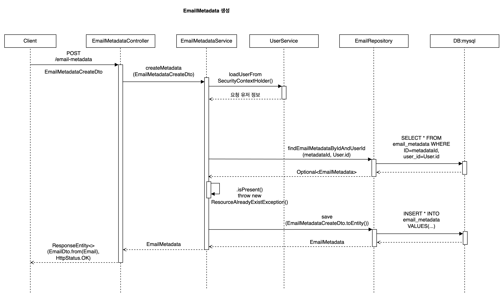

# mailService

## 서비스 구현 목적 & 기능

[Spark](https://sparkmailapp.com/) 서비스와 같은 통합 메일 서비스에 필요한 비동기 처리를 통한 예약 전송 등을 공부 목적으로 구현.

진행기간: 2022-07-29 ~ 2022-10-27

**기능**

- 메일 서비스의 정보(SMTP)를 저장하고, 민감정보는 암호화 적용
- 즉시전송과 예약전송을 통해 유저가 필요한 시점에서 메일을 전송할 수 있게 관리
- 수신 기능은 구현하지 않음

---

## 구조

### 데이터 구조

- 사용자와 메일 서비스에 필요한 인증정보는 relation 으로 처리.
- 메일 데이터는 수신자, 송신자가 같은 서비스의 유저일 경우, 2개의 중복데이터를 방지하고자 relation 없이 수신자ID, 송신자ID 를 정의하여 쿼리를 통해 조회할 수 있도록 의도.
- BaseEntity 를 통해 생성시간, 수정시간 같은 공통 필드 정의

 

### 서비스 처리 흐름

---

## asynchronous & multi-module

즉시전송과 예약 전송 기능을 고려하여 비동기적으로 설계하였다.
서버에서 즉시전송과 예약 전송을 동시 처리가 필요하고, 사용자의 요청시간을 줄이기 위해 적용하였다.
또한 메일 서비스 특징 상, 메일 요청 완료까지 대기할 필요가 없고, 성공/실패 여부에 따라 메일함 분류가 나뉠 수 있기 때문.

- 사용자는 메일 전송 요청시 즉시전송/예약전송 여부에 따라 전송내역생성/즉시전송메시지큐전송 으로 나뉨
- 즉시전송 Consumer 는 메시지큐로부터 메일을 전달받아 즉시 전송을 처리하고, 전송내역을 DB에 생성한다.
- 예약전송큐삽입 Consumer 는 1분마다 Task 가 실행되어 해당 시간에 전송되어야할 메일을 예약전송메시지큐에 삽입한다.
- 예약전송 Consumer 는 예약전송큐로부터 전달받은 메일을 전송하고, 전송내역을 DB에 업데이트한다.

> 즉시전송/예약전송 모두 단일 메일전송을 성공시키기 위해 Kafka 메시지큐를 도입했다.

### multi-module 코드 구조

mail-core: 메일 Entity, Repository 와 같은 공통 모듈 정의

mail-api: 메일 전송 요청을 받기 위한 모듈로 메시지 produce.

mail-service: 실제 메일 전송을 담당. 즉시전송/예약전송을 처리하고 메시지 consume.

---

## 간단 작업내용

- 인증은 JWT 로 구현.
- HTTP 상태 관리는 `org.springframework.http.HttpStatus` 를 활용
- Controller-Service-Repository layer를 기준으로 로직마다 전달할 데이터는 모두 DTO로 관리
- 내부 로직에 필요한 테스트케이스 정의

## 피드백과 self-질문

### 피드백

- 모놀리식으로도 구현가능한 구조이기에 multi-module 을 공부 목적 외로 필수로 도입할 필요가 없다.
- 구현과 문서 명시 작업은 동시에 처리하는게 아니다. 문서를 먼저 명시하고 작업할 수 있게 충분히 생각할 시간과 과정이 필요.

아래는 코드 피드백

- try-catch는 가능하면 controller 이전 다른 계층에서 처리하는게 좋다.
- try-catch 단위: validation() -> logic() -> return
- 코드 depth는 최소화하자. 가급적 로직에서 2-depth를 넘어가면 가독성이 떨어지고, 코드가 복잡해짐.
- `Optional` 사용 시 여러 계층까지 데이터가 오가기 때문에, 이 과정에서 검증하는 로직이 필요하다. 코드량이 늘어나 코드 커버리지가 낮아질 수 있다.
- 모든 기능은 명칭과 처리가 동일시하도록 정의하자.
- admin 기능과 user 기능은 분리하여 정의하자. (백오피스 기능 구현 중 피드)
- 리소스와 서비스로직은 별도의 controller, service로 혼용되지 않도록 관리하는게 좋다.
- RESTful 한 설계 시 상위-하위 리소스에 맞게 URI를 명시하자.
- 특정 값을 파싱/입력 시 올바른 처리결과 유무를 위해 handling 및 테스트케이스 필요. (더 많은 unit-test..)
- DTO-entity 간 from/to 전략을 적절히 사용하자.
- 각 entity, DTO 의 유효성 기준을 미리 적용하자.
- null 을 확인하는 과정은 오류 혹은 동작정지를 일으키는 주범이다. default 실패 값을 설정하거나, 꼭 null 확인이 필요한 경우는 `Objects.isNull`을 사용하자.
- 반복 사용되지 않은 변수는 선언 없이 호출로만 처리해도 무관. 단, 명칭은 명확해야함.
- Spring은 기본적으로 singleton 패턴을 사용하기 때문에, utility 기능은 꼭 정적 클래스로 선언하지 않아도 된다. `@Component` 와 같이 Bean 으로 등록하여 사용해도 큰 성능차이를 보이지 않는다.
- 테스트케이스는 모든 기능에 대해 SUCCESS/FAIL 케이스를 정의하는게 좋다. (TDD는 어렵다..)
- 하나의 테스트는 1개의 요소를 처리한다. 여러개의 테스트를 하나의 테스트에서 진행하지 말자.

### self-질문

- 비동기 프로세스로 메일 전송을 보낸다고 가정했을 때, 서비스가 감당할 수 있는 트래픽의 규모를 기준으로 테스트는 어떻게 진행할 수 있을까? 
-> 동시성 테스트는 다중 스레드를 통해 시도해볼 수 있을 것 같다. 대규모 트래픽 기준의 테스트 영역은 더 공부가 필요하다.
- PR의 크기가 큰 경우가 많다. 협업 시 큰 문제가 될 텐데 어떻게 줄일 수 있을 것인가?
-> 기능 구현에 필요한 스펙문서를 정확하게 정의한다. 그리고, 각 기능에 필요한 요소를 미리 정의하고, 다이어그램과 같은 툴을 이용해 코드 구조를 미리 정하는 것도 좋은 방법이다.
